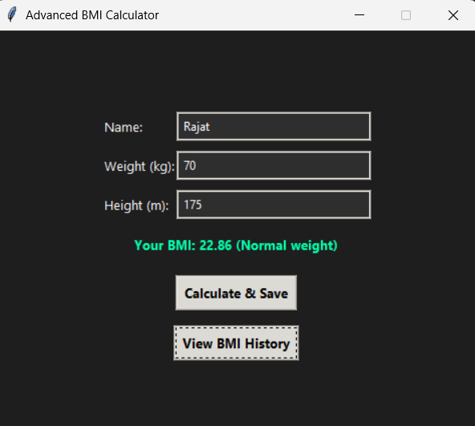
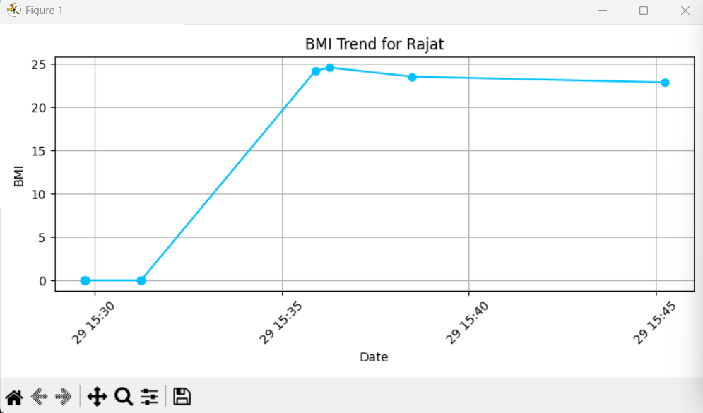

# 🧮 Advanced BMI Calculator

A modern, glassy **Python BMI Calculator** with a sleek Tkinter GUI, BMI history tracking, CSV-based storage, and trend analysis via Matplotlib.

> 🔧 Built by **Rajat Shinde** as part of an internship project to demonstrate practical GUI application development, data handling, and user experience design in Python.

---

## 🚀 Features

- ✅ Beautiful **glassy Tkinter interface**
- 🧠 Accurate **BMI calculation & classification**
- 💾 Persistent **data storage** in CSV format
- 📈 **History graph** with trendline using Matplotlib
- 🔒 Input validation & error handling
- 🗃️ Organized modular structure for maintainability

---

## 📷 Screenshots

| Input Form | BMI Result |
|------------|-------------|
|  |  |

---

## 🛠️ Tech Stack

| Tech          | Purpose                          |
|---------------|----------------------------------|
| **Python 3.10+**   | Core programming language      |
| **Tkinter**    | Graphical User Interface         |
| **Pandas**     | Data handling & CSV operations   |
| **Matplotlib** | BMI trend graph visualization    |
| **Virtualenv** | Dependency isolation (`.venv`)   |

---

## 🗂️ Folder Structure

```
AdvancedBMI/
├── bmi_app/
│   ├── gui.py           # Main GUI
│   ├── bmi_logic.py     # BMI logic & categorization
│   ├── storage.py       # CSV read/write functions
│   ├── plotter.py       # BMI history graph
│   └── __init__.py
├── data/
│   └── bmi_history.csv  # Stored automatically
├── assets/
│   └── glass_bg.png     # Optional UI assets
├── main.py              # App entry point
├── requirements.txt     # Dependencies
└── README.md            # Project documentation
```

---

## 📦 Installation

### ✅ Step 1: Clone the Repo
```bash
git clone https://github.com/RajatShinde3/AdvancedBMI.git
cd AdvancedBMI
```

### ✅ Step 2: Create and Activate Virtual Environment
```bash
python -m venv .venv
# Windows:
.venv\Scripts\activate
# macOS/Linux:
source .venv/bin/activate
```

### ✅ Step 3: Install Dependencies
```bash
pip install -r requirements.txt
```

### ✅ Step 4: Run the Application
```bash
python main.py
```

---

## 🔐 Input Validation

- ✔️ No empty fields allowed
- ✔️ Height & weight must be positive numbers
- ✔️ BMI auto-classified: Underweight, Normal, Overweight, Obese

---

## 📈 Graphing BMI Trends

Click `View BMI History` to visualize your historical BMI progress using Matplotlib.

---

## 🙋‍♂️ Author

**Rajat Shinde**  
Built during Oasis Internship | 2025

---
